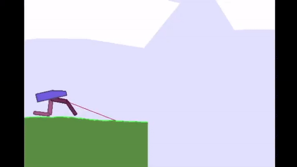
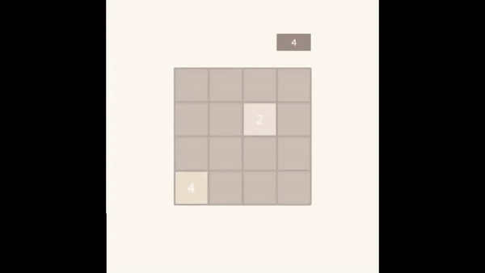
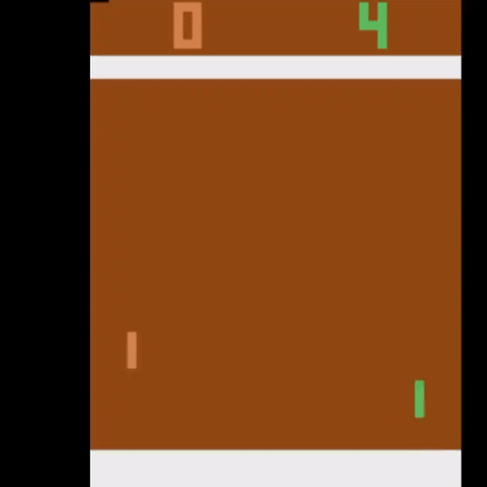
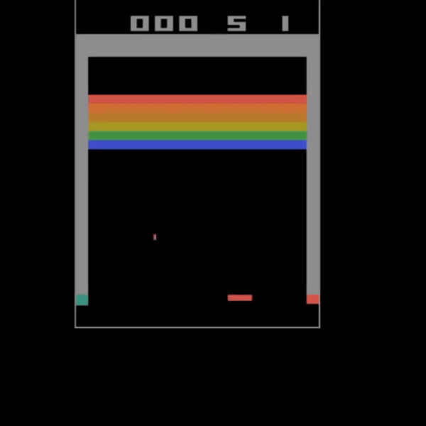

# About

This repository was for testing deep reinforcement learning
algorithms, especially trying to implement them from their papers. I have since
abandoned this to make a new repository to better organize and document
the code. \

Below are some of agents I have properly trained, 
as well as a 2048 gym environment I implemented.

### Finished algorithms

\
Implemented with a DDPG algorithm

\
Implemented with a DQN algorithm

\
Implemented with a DQN algorithm

\
There are two programs that work for Breakout, one PPO one Rainbow (Rainbow has some
implementation errors)

### DQN + GAN for exploration
Worked on combining a GAN with a DQN algorithm for exploration
in the Summer Stem Institute program. Didn't finish because lacked the
resources to fully evaluate the algorithms performance \
(MontezumaGAN.py, though it is currently set to Breakout) \
(Paper written while in the Summer Stem Institute: https://www.overleaf.com/read/tsxbtnpnjhkf)
